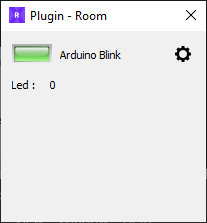


# PyControlPanel
*<a href="https://www.learnpyqt.com/" target="_blank">PyQt5</a> applet to create a prop control panel.*

In the area of ​​Escape Room creation, we need to code quickly and reliably, and we need to streamline and reuse our code.

From this control panel skeleton you can write a prop control panel in minutes.


 
 
## Installation

### Installation on Windows

1. First install Python 3.8.x in `C:\Python38` ([Windows x86-64 executable installer](https://www.python.org/ftp/python/3.8.2/python-3.8.2-amd64.exe) from <a href="https://www.python.org/downloads/release/python-382/" target="_blank">python.org</a>)

2. Download [`PanelInstallation.zip`](https://github.com/xcape-io/PyPropControl/raw/master/PyPropControlPanel/PanelInstallation.zip) from this GitHub repository 

3. Unflate it in your panel folder

4. Run `install.bat` with a double-click to create the Python virtual environment (*venv*).

5. Set MQTT broker IP address in `constants.py`

    ```python
    MQTT_DEFAULT_HOST = 'localhost'  # replace localhost with your broker IP address
    ```

6. Run `test.bat` to test your new panel.

### Installation on Mac, Linux and Raspberry
*PyControlPanel* is a pure python applet so you can install it on any computer running python with <a href="https://www.learnpyqt.com/" target="_blank">PyQt5</a>.

#### Example of installation on Ubuntu/Debian based distros
You will have to install following Python packages:
```bash
$ sudo apt-get update
$ sudo apt-get install python3-pip
$ pip3 install --user pyqt5
$ sudo apt-get install python3-pyqt5
$ sudo apt-get install qt5-default pyqt5-dev pyqt5-dev-tools
```

Then:

1. Download [`PanelInstallation.zip`](https://github.com/xcape-io/PyPropControl/raw/master/PyPropControlPanel/PanelInstallation.zip) from this GitHub repository 

2. Unflate it in your panel folder

3. From your control panel folder, install requirements
    ```bash
    $ pip3 install -r requirements.txt
    ```

4. Start the panel, assuming your MQTT broker IP address is 192.168.1.42
    ```bash
    $ python3 main.py -s 192.168.1.42
    ```

#### Installation on Raspberry Pi
With the new Raspberry Pi 4 with 2 HDMI outputs and 4GB memory, controlling your escape room with a Raspberry Pi starts to make sense.

You will have to install following Python packages:
```bash
$ sudo apt-get update
$ sudo apt-get install qt5-default pyqt5-dev pyqt5-dev-tools
$ sudo apt-get install python3-pyqt5 python3-pyqt5-dbg
```

Then:

1. Download [`PanelInstallation.zip`](https://github.com/xcape-io/PyPropControl/raw/master/PyPropControlPanel/PanelInstallation.zip) from this GitHub repository 

2. Unflate it in your panel folder

3. From your control panel folder, install requirements
    ```bash
    $ pip3 install -r requirements.txt
    ```

4. Start the panel, assuming your MQTT broker IP address is 192.168.1.42
    ```bash
    $ python3 main.py -s 192.168.1.42
    ```


## Creating your own control panel
<a href="https://www.jetbrains.com/pycharm/download/" target="_blank">Pycharm Community</a> is the free python IDE recommenbded for developing your own control panel.

1. Edit `definitions.ini` to set the MQTT topics for your prop

2. Edit `constants.py` to set your prop name and other constants specific to your application

3. Edit `PanelDialog.py` to develop your own prop control panel

In `./core` folder you will find the most useful widgets for building a control panel:

* **<a href="https://github.com/xcape-io/PyPropControl/blob/master/core/DataWidget.py" target="_blank">DataWidget</a>**
* **PushButton**
* **SwitchWidget**
* **<a href="https://github.com/xcape-io/PyPropControl/blob/master/core/ToggleButton.py" target="_blank">ToggleButton</a>**

For this example, we built a plugin to control an Arduino Yún running the **BlinkOnBridgeProp** sketch <a href="https://github.com/xcape-io/ArduinoProps/tree/master/examples" target="_blank">example</a> from the <a href="https://github.com/xcape-io/ArduinoProps" target="_blank">ArduinoProps library</a>.

Alternatively it works the same with:
* **BlinkOnEthernetProp**
* **BlinkOnWifiProp**
* **BlinkOnBridgePubSub**


## Author

**Marie FAURE** (Apr 19th, 2020)
* company: FAURE SYSTEMS SAS
* mail: *dev at faure dot systems*
* github: <a href="https://github.com/fauresystems?tab=repositories" target="_blank">fauresystems</a>
* web: <a href="https://faure.systems/" target="_blank">Faure Systems</a>