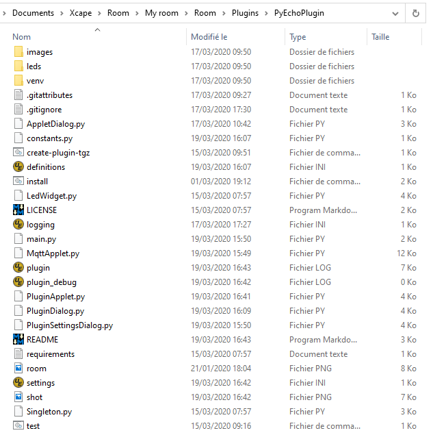

# PySkeletonPlugin
 ***Plugin to quickly create a plugin for xcape.io Room.***

 Work in progress...

In the area of ​​Escape Room creation, we need to code quickly and reliably, and we need to streamline and reuse our code.

With this plugin skeleton you can write a plugin for *<a href="https://xcape.io/" target="_blank">xcape.io</a>* **Room** software in minutes.


 
To write your very first **Room** plugin, we recommend you follow the 
<a href="https://xcape.io/public/documentation/en/room/Plugintutorial.html" target="_blank">Plugin tutorial</a> in the <a href="https://xcape.io/public/documentation/en/room/Help.html" target="_blank">**Room** manual</a>.
 
## Installation

# !!! First install Python 3.8.x in C:\Python38 (use install.bat to create venv)

Create your new plugin folder in you room *Plugins* folder, example for a plugin we want named as **Echo** :

```bash
C:\Users\jm_de\Documents\Xcape\Room\My room\Room\Plugins\PyEchoPlugin

```

Download `PySkeletonPlugin-master.zip` from this GitHub repository and unflate it in your plugin folder (not in `PySkeletonPlugin-master` folder).



Run `install.bat` with a double-click to create the Python virtual environment (*venv*).

Run `test.bat` to test you new **Echo** plugin.

You are now ready to hack a new plugin :
* add it to ***Room*** software (<a href="https://xcape.io/public/documentation/en/room/AddEchoPlugintoyourroom.html" target="_blank">see ***Room*** manual</a>)
* create a new PyCharm project in the plugin folder (<a href="https://xcape.io/public/documentation/en/room/EditEchopluginwithPyCharm.html" target="_blank">see ***Room*** manual</a>)


## Author

**Marie FAURE** (Mar 17th, 2020)
* company: FAURE SYSTEMS SAS
* mail: *dev at faure dot systems*
* github: <a href="https://github.com/fauresystems?tab=repositories" target="_blank">fauresystems</a>
* web: <a href="https://faure.systems/" target="_blank">Faure Systems</a>