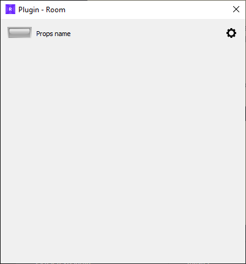

# PyRoomPlugin
 ***PyQt5 applet to quickly create a plugin for <a href="https://xcape.io/" target="_blank">xcape.io</a> Room.***

In the area of ​​Escape Room creation, we need to code quickly and reliably, and we need to streamline and reuse our code.

With this plugin skeleton you can write a plugin for *<a href="https://xcape.io/" target="_blank">xcape.io</a>* **Room** software in minutes.

 
To write your very first **Room** plugin, we recommend you follow the 
<a href="https://xcape.io/public/documentation/en/room/Plugintutorial.html" target="_blank">Plugin tutorial</a> in the <a href="https://xcape.io/public/documentation/en/room/Help.html" target="_blank">**Room** manual</a>.
 
## Installation

1. First install Python 3.8.x in `C:\Python38` ([Windows x86-64 executable installer](https://www.python.org/ftp/python/3.8.2/python-3.8.2-amd64.exe) from <a href="https://www.python.org/downloads/release/python-382/" target="_blank">python.org</a>)

2. Download [`PluginInstallation.zip`](https://github.com/xcape-io/PyPropControl/raw/master/PyRoomPlugin/PluginInstallation.zip) from this GitHub repository 

3. Unflate it in your plugin folder

4. Run `install.bat` with a double-click to create the Python virtual environment (*venv*).

5. Run `test.bat` to test your new plugin.

You are now ready to hack a new plugin :
* add it to ***Room*** software (<a href="https://xcape.io/public/documentation/en/room/AddEchoPlugintoyourroom.html" target="_blank">see ***Room*** manual</a>)
* create a new PyCharm project in the plugin folder (<a href="https://xcape.io/public/documentation/en/room/EditEchopluginwithPyCharm.html" target="_blank">see ***Room*** manual</a>)

## Author

**Marie FAURE** (Apr 19th, 2020)
* company: FAURE SYSTEMS SAS
* mail: *dev at faure dot systems*
* github: <a href="https://github.com/fauresystems?tab=repositories" target="_blank">fauresystems</a>
* web: <a href="https://faure.systems/" target="_blank">Faure Systems</a>